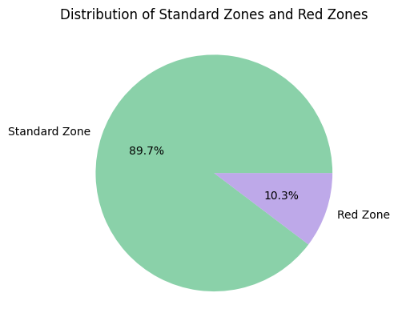
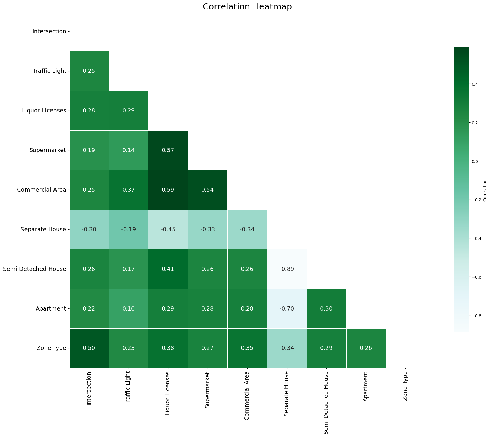
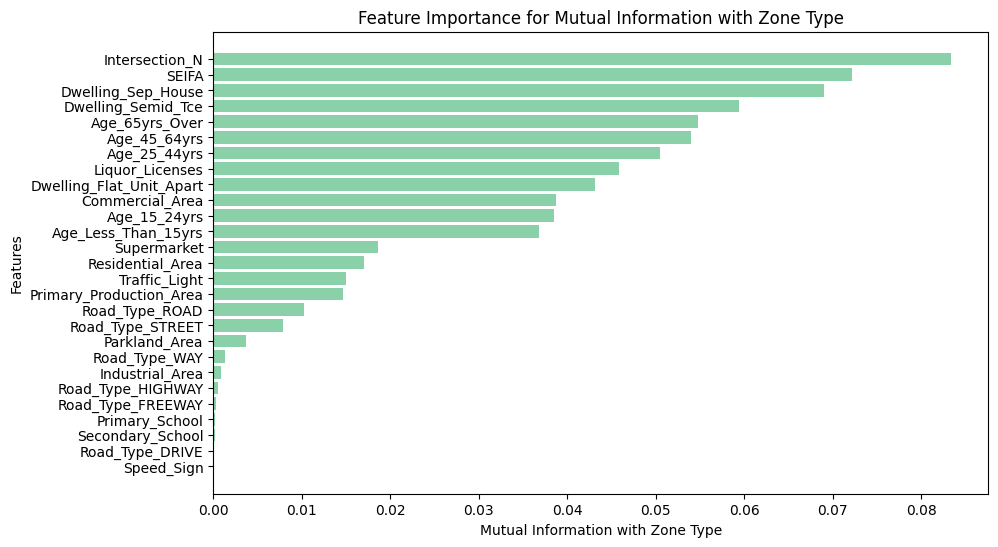
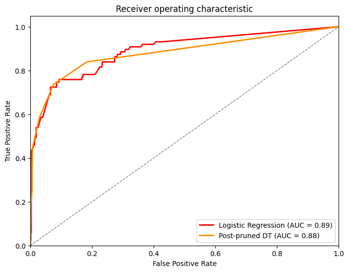
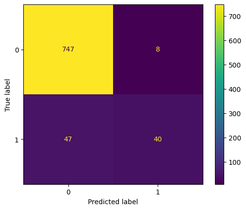
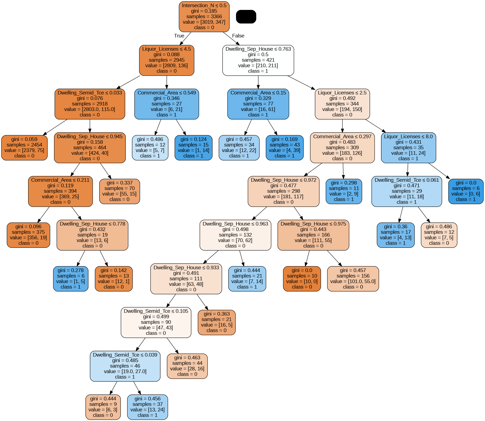
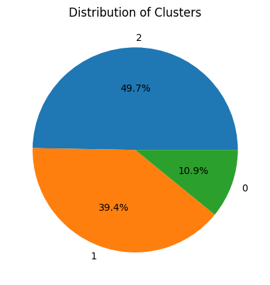
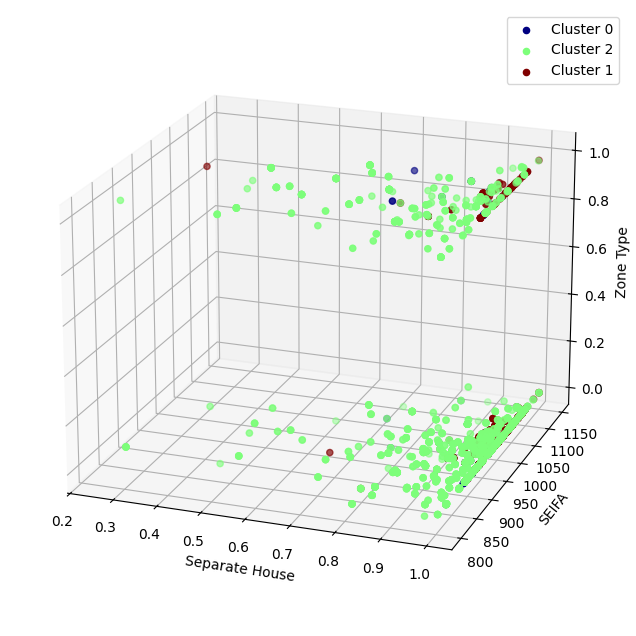

# Predicting High-Risk Road Zones with Machine Learning

## Overview

This project uses supervised and unsupervised machine learning to identify **Red Zones** — road segments with elevated accident risk — for a transport safety startup partnering with a motor insurer to power a real-time driver alert app.

Using Python, I developed and compared multiple classification models to predict Red Zones, and applied clustering to explore natural groupings in road segment characteristics. The analysis combines data quality assessment, exploratory data analysis, feature selection, model development, and business recommendations into a single end-to-end workflow.



---

## Business Problem

Existing data shows that 10.3% of road segments are classified as Red Zones — areas with disproportionately high accident risk. Left unaddressed, these zones put drivers at risk and drive up motor insurance claims.

This project aims to answer the following questions:

- Which road, land-use, and demographic factors are most associated with Red Zones?
- Can a machine learning model reliably predict Red Zones from road segment characteristics?
- Which model should power a real-time driver alert app, and what are its limitations?
- What should be the next actions?

The objective was to translate this into a decision-ready recommendation: which model (if any) is ready to underpin a safety-critical, real-time driver alert feature.

---

## Dataset

- 5,013 road segment records, 31 original features, sourced from a real-world dataset that was pre-processed and resampled for analytical use.
- Feature categories: road segment information, traffic control & infrastructure, amenities & services, land use composition, housing characteristics, socioeconomic indicators, demographic profile, household composition, and vehicle ownership.
- Target variable: `Zone_Type` (Standard Zone vs. Red Zone), with a substantial class imbalance (89.7% vs. 10.3%).

---

## Tools & Techniques

**Tools**
- Python (Google Colab)
- pandas, NumPy — data cleaning and transformation
- scikit-learn — model development, evaluation, hyperparameter tuning
- Matplotlib, Seaborn — exploratory visualization
- pydotplus / Graphviz — decision tree visualization

**Techniques**
- Data quality assessment and rule-based imputation
- Exploratory data analysis (univariate, bivariate, multivariate)
- Feature selection via correlation analysis and mutual information
- Supervised classification: Logistic Regression, Decision Trees (base, pre-pruned, post-pruned)
- Hyperparameter optimization via grid search with 5-fold cross-validation
- Unsupervised learning: K-Means clustering with silhouette and Davies-Bouldin evaluation
- Model evaluation: accuracy, precision, recall, F1, ROC AUC, confusion matrices

---

## Methodology

### 1. Data Quality Assessment & Preprocessing

The raw dataset had several real-world quality issues that needed resolving before modeling:

- **Group totals not summing correctly.** Features like Land Use Composition, Housing Characteristics, and Demographic Profile are each meant to sum to 100% within a record. Where exactly one sub-feature was missing, it was imputed as the remainder (100% minus the others). Where more than one was missing, or the group total fell outside a 95–105% tolerance band, the row was dropped.
- **Structurally unreliable feature groups.** Household Composition and Vehicle Ownership contained a high rate of internal inconsistencies (>10% and 24% of rows respectively) and were dropped entirely rather than patched, since imputing them would have introduced more noise than signal.
- **Categorical encoding.** `Intersection` and `Zone_Type` were mapped to binary flags; `Road_Type` was one-hot encoded.

Net effect: 16.06% of rows (805 of 5,013) were removed, along with several unreliable feature groups. This tradeoff was made deliberately — preserving data integrity for the remaining ~84% of records rather than retaining more rows at the cost of introducing unreliable imputed values.

### 2. Exploratory Data Analysis

Univariate and bivariate analysis was used to understand feature distributions and their relationship to `Zone_Type`, including regression plots, KDE plots, box plots, and a full correlation heatmap.



Mutual information scores were also calculated to guide feature selection independently of linear correlation assumptions, which mattered given several predictors are categorical/binary rather than continuous.



### 3. Supervised Machine Learning

Two model families were developed and compared:

**Logistic Regression** (baseline)

| Metric | Score |
|---|---|
| Accuracy | 0.93 |
| Precision | 0.83 |
| Recall | 0.46 |
| F1 | 0.59 |
| ROC AUC | 0.89 |

**Decision Trees** (base, pre-pruned, post-pruned, then hyperparameter-optimized via grid search + 5-fold cross-validation)

| Metric | Base DT | Pre-Pruned | Post-Pruned | Optimized (final) |
|---|---|---|---|---|
| Accuracy | 0.93 | 0.92 | 0.94 | 0.93 |
| Precision | 0.75 | 0.76 | 0.89 | 0.75 |
| Recall | 0.47 | 0.39 | 0.45 | 0.48 |
| F1 | 0.58 | 0.52 | 0.60 | 0.59 |
| ROC AUC | 0.74 | 0.89 | 0.88 | — |







### 4. Unsupervised Machine Learning — Clustering

A K-Means clustering model was built on features selected via mutual information (intersection presence, SEIFA index, dwelling type, and age bands). After testing cluster counts from 2 to 40 against WCSS, silhouette score, and Davies-Bouldin index, **k = 3** was selected as the best-separated solution (silhouette score 0.49, Davies-Bouldin index 0.79).





The clusters revealed meaningful natural groupings (e.g. one cluster skewed toward older residents, higher intersection density, and a much higher concentration of Red Zones), but the cluster sizes and Red Zone distributions were too imbalanced across clusters to serve as a standalone tool.

---

## Key Insights

- **Intersections, commercial areas, and liquor licenses are the strongest predictors of Red Zones.** Road segments with any of these present were disproportionately likely to be classified as high-risk.
- **Streets carry more relative risk than other road types**, despite Roads being more numerous overall.
- **Housing type matters more than raw demographics.** Apartments and semi-detached housing were more associated with Red Zones than age or income indicators, though the SEIFA (socioeconomic) index showed a weak negative relationship with risk.
- **Accuracy is a misleading headline metric here.** With Red Zones representing only 10.3% of records, a model could score 90%+ accuracy while still missing most actual high-risk zones — which is why precision, recall, and F1 (not just accuracy) drove model selection.
- **No model tested is currently deployment-ready.** The best-performing Decision Tree recalls less than half of all actual Red Zones (48%), meaning more than half of genuinely high-risk segments would go unflagged in a live app.

---

## Recommendation

The **optimized Decision Tree** is the recommended model going forward, edging out Logistic Regression on recall (0.48 vs. 0.46) despite slightly lower precision (0.75 vs. 0.83). In a road-safety context, a model that over-predicts Red Zones (more false alarms) is preferable to one that under-predicts them (more missed genuine risks) — making the Decision Tree's recall advantage the deciding factor, even though its precision is lower.

Clustering did not produce a viable substitute for prediction, but it did surface useful segment profiles that could inform future feature engineering (e.g. an "older residents + high intersection density" profile strongly associated with elevated risk).

**This model is not yet ready for production deployment.** A recall of 48% means more than half of actual high-risk zones would go undetected in a live safety-critical app — a genuine limitation.

### Recommendations for next steps

1. **Expand and rebalance the dataset.** Collect additional features found relevant in prior road-safety research (e.g. pavement condition), and address the underlying class imbalance through further data collection or class-weighted modeling.
2. **Test ensemble methods.** Random Forest and other ensemble approaches were deliberately scoped out of this phase and are the logical next model family to test for improved recall.
3. **Run a beta program before full deployment.** Recruit volunteer users to trial the app pre-launch, generating real-world feedback and additional labeled data to refine the model.
4. **Address privacy and consent requirements up front.** Since the app relies on real-time GPS data, its design needs to account for the Australian Privacy Act 1988 — explicit consent, data security safeguards, and transparency about model accuracy and limitations (including the risk of false positives and negatives).

---

## Repository Structure

```text
├── Data
│   ├── Data_Dictionary.csv
│   └── Sample_Dataset.csv
│
├── Images
│   ├── 01_zone_type_distribution.png
│   ├── 02_road_type_distribution.png
│   ├── 03_correlation_heatmap.png
│   ├── 04_feature_importance_mutual_info.png
│   ├── 05_roc_curve_comparison.png
│   ├── 06_confusion_matrix_best_model.png
│   ├── 07_optimized_decision_tree.png
│   ├── 08_cluster_red_zone_distribution.png
│   └── 09_cluster_3d_visualization.png
│
├── Notebooks
│   └── Red_Zone_Prediction_Analysis.ipynb
│
├── .gitignore
├── Requirements.txt
└── README.md
```

---

## Skills Demonstrated

**Data Engineering**
- Data quality assessment and rule-based imputation
- Handling structurally unreliable feature groups
- Categorical encoding (mapping, one-hot encoding)

**Analytics & Machine Learning**
- Exploratory data analysis (univariate, bivariate, multivariate)
- Feature selection (correlation analysis, mutual information)
- Supervised classification (Logistic Regression, Decision Trees)
- Model tuning (pruning, grid search, cross-validation)
- Unsupervised learning (K-Means clustering, cluster evaluation)
- Model evaluation on imbalanced classification problems

**Business & Communication**
- Translating model performance into a deployment recommendation
- Tailoring findings for both technical and executive audiences (two separate reports)
- Ethical and regulatory considerations (privacy, consent, algorithmic transparency)
